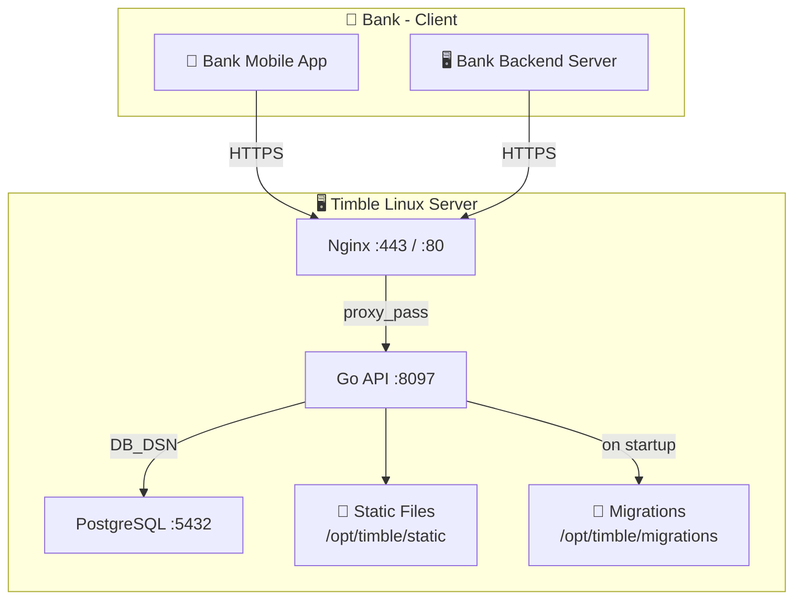
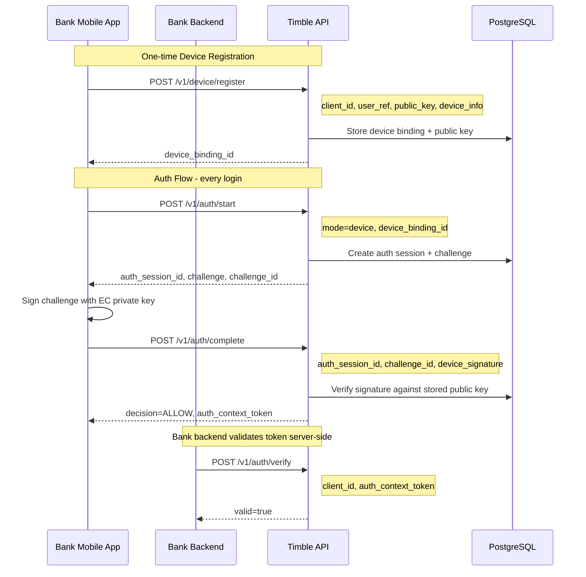
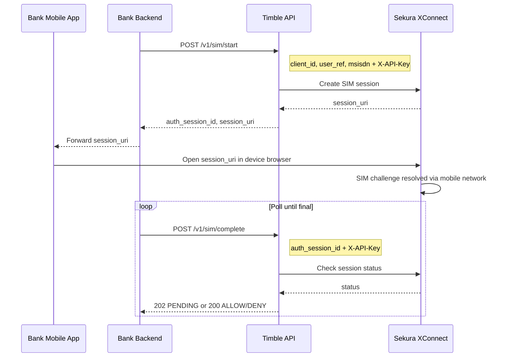
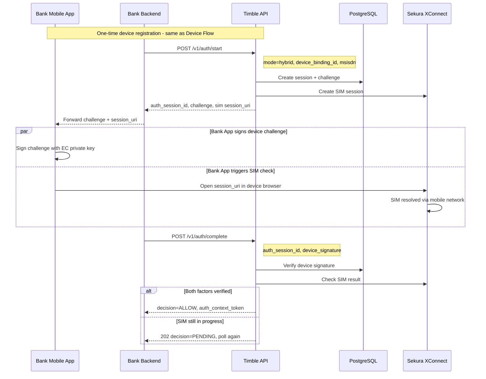

# Timble API Flow & Architecture

Diagrams showing how the **Bank (client)** integrates with the **Timble authentication server** across all supported auth modes.

---

## Deployment Architecture

---

## Flow 1 — Device Authentication

The bank mobile app holds an EC key pair. Timble issues a challenge; the app signs it; Timble verifies the signature. The bank backend validates the resulting token server-side.

---

## Flow 2 — SIM Authentication

The bank backend drives the API calls. The bank app is redirected to a Sekura URL where the SIM card challenge is resolved silently over the mobile network. The backend polls Timble until a final decision is returned.

---

## Flow 3 — Hybrid Authentication

Combines both factors: device cryptography **and** SIM verification in a single session. The app signs the device challenge and opens the SIM redirect in parallel. The bank backend polls Timble until both factors are confirmed.

